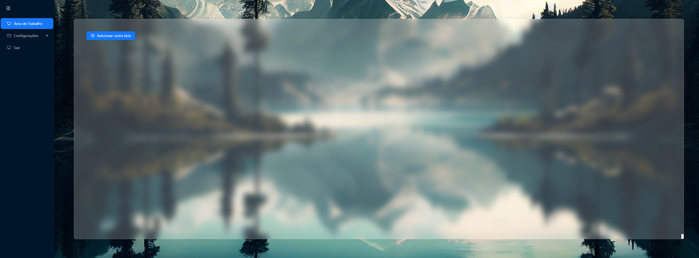
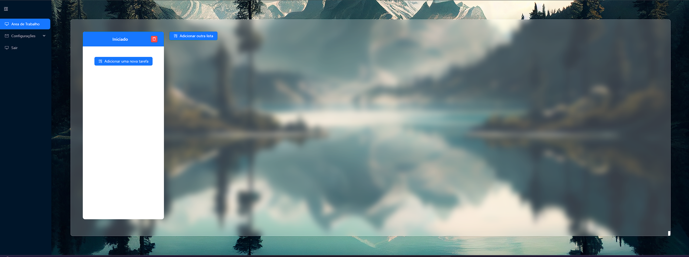
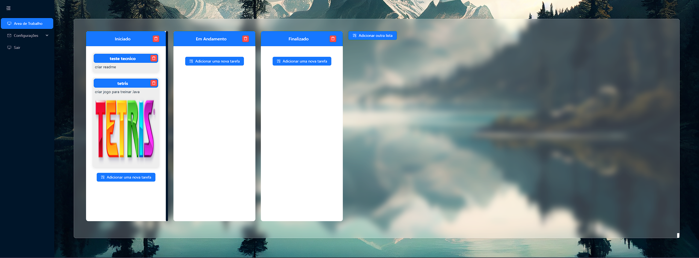

# Teste Técnico Brickup

Um simples sistema de gerenciamento de tarefas, utilizando as seguintes tecnologias:

## Frontend
- React
- Typescript
- Redux
- Ant Design
- Styled Components
- Redux-Saga

## Backend
- Spring Boot
- Hibernate
- Jackson






## Requisitos para Rodar
Certifique-se de ter as seguintes tecnologias instaladas antes de prosseguir:

### Frontend
- Node.js
- npm

### Backend
- Java
- Maven

# Tutorial

### Backend
```bash
  cd backend
  mvn dependency:resolve
  mvn spring-boot:run
```

### Frontend
```bash
  cd frontend
  npm install
  npm run dev
```


